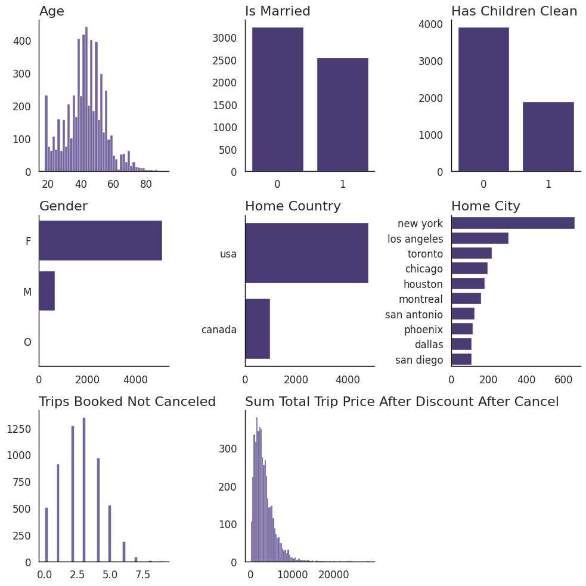
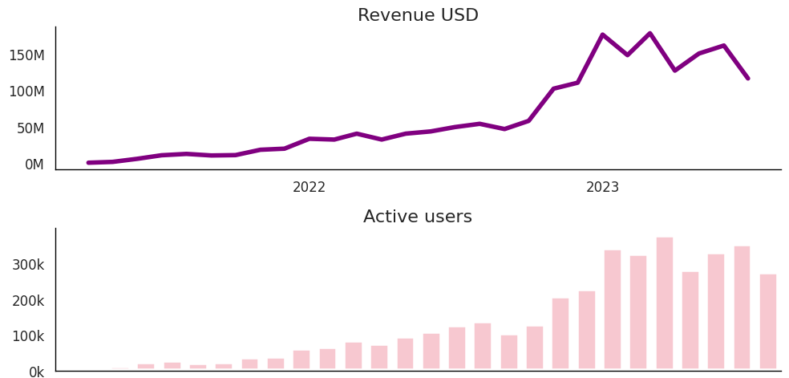
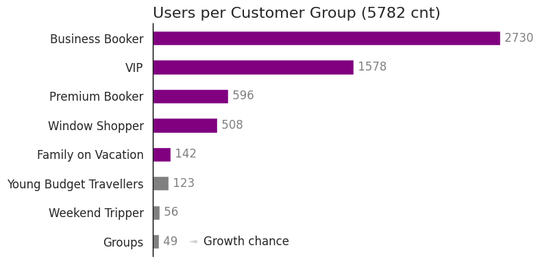

# Analyst report

**Project**: Customer Retention Program 
**Data Analyst**: Thorsten Weber 
**Date**: 09.07.2025

## 🔍 Exploratory Analysis

### The Average User

Our users are female (80%) around 43 years old and booked 2.5 trips in 2023. Half is married, every third has one or more kids. Majority of 80% live spread across USA (rest in Canada) with NY being number one hometown for 11% of our users. They have booked about 3 trips with us in 2023. The overall cancelation rate is low.

### Our Performance

* **KPIs**: 16M USD revenue in 2023 generated by 16k booked trips by 5,8k users. Spend per seat is around 316 EUR preferably short-medium-haul flights.
* **Lost revenue** of 1,3M USD cased by cancelations should be adressed by a seperate win-back program
* **Hyper-growth has stopped** in Q2 2023 after a great 2022 with exponential growth driven be continuous increase of new users. Danger of a continous downwards trend or at least stagnation.

  

  

## 🧩 Retention Program  

### Three Building Blocks

We have very different target groups. From business travelers, the young budget oriented and the rich and wealthy VIPs or premium bookers. Accordingly we need a comprehensive program giving every group what it desires most. From discounts to status. Additionally we recommend a win-back-program addressing our 10% of window shoppers.

1. A **status program** with different status levels ranging from "Gold", "Silver", "Bronze" giving different perks worth more than money like membership cards, lounge access or limo service. You earn status points by booked trips, miles or money spend.
2. A **customer segment** oriented data-driven approach offering  offering individual perks and adressing them with highly personalized marketing campagins.
3. The **Win-Back-Program** adresses our Window Shoppers which not only browse but also book and cancel immediately. 

### Eight Customer segments

**Top 3** segments are B2B- (48%), VIP- (27%) and Premium (10%) bookers followed by window shopper. Underrepresented groups are families, users below 20, weekend tripper and groups

Strong **growth potential** in underserved user groups (men, Families, young, weekend and group travelers). They are both small in terms of absolut users and also bear a lower amount of booked trips. Check UX and marketing mix.

Click arrow for detailed metrics per user segment

<table>
  <thead>
    <tr>
      <th><b>Metric</b></th>
      <th><b>Business Booker</b></th>
      <th><b>VIP</b></th>
      <th><b>Premium Booker</b></th>
      <th><b>Window Shopper</b></th>
      <th><b>Family on Vacation</b></th>
      <th><b>Young Budget Travellers</b></th>
      <th><b>Weekend Tripper</b></th>
      <th><b>Groups</b></th>
    </tr>
  </thead>
  <tbody>
    <tr style="background-color:#f2f2f2;">
      <td>Number of Users</td>
      <td>2730</td>
      <td>1578</td>
      <td>596</td>
      <td>508</td>
      <td>142</td>
      <td>123</td>
      <td>56</td>
      <td>49</td>
    </tr>
    <tr style="background-color:#ffffff;">
      <td>Average Age</td>
      <td>43</td>
      <td>44</td>
      <td>45</td>
      <td>39</td>
      <td>42</td>
      <td>22</td>
      <td>49</td>
      <td>46</td>
    </tr>
    <tr style="background-color:#f2f2f2;">
      <td>Most Common Gender</td>
      <td>F</td>
      <td>F</td>
      <td>F</td>
      <td>F</td>
      <td>F</td>
      <td>F</td>
      <td>F</td>
      <td>F</td>
    </tr>
    <tr style="background-color:#ffffff;">
      <td>Ratio Married</td>
      <td>44.4%</td>
      <td>46.8%</td>
      <td>49.0%</td>
      <td>38.4%</td>
      <td>45.8%</td>
      <td>4.9%</td>
      <td>51.8%</td>
      <td>36.7%</td>
    </tr>
    <tr style="background-color:#f2f2f2;">
      <td>Ratio Has Children</td>
      <td>33.3%</td>
      <td>28.7%</td>
      <td>30.2%</td>
      <td>32.3%</td>
      <td>97.9%</td>
      <td>24.4%</td>
      <td>21.4%</td>
      <td>0.0%</td>
    </tr>
    <tr style="background-color:#ffffff;">
      <td>Most Common Home Country</td>
      <td>usa</td>
      <td>usa</td>
      <td>usa</td>
      <td>usa</td>
      <td>usa</td>
      <td>usa</td>
      <td>usa</td>
      <td>usa</td>
    </tr>
    <tr style="background-color:#f2f2f2;">
      <td>Avg Trips Booked</td>
      <td>2.88</td>
      <td>3.83</td>
      <td>1.8</td>
      <td>0.0</td>
      <td>1.7</td>
      <td>1.49</td>
      <td>1.54</td>
      <td>1.24</td>
    </tr>
    <tr style="background-color:#ffffff;">
      <td>Avg Cancellation Rate</td>
      <td>3.3%</td>
      <td>1.3%</td>
      <td>5.7%</td>
      <td>17.1%</td>
      <td>6.7%</td>
      <td>5.1%</td>
      <td>4.0%</td>
      <td>8.8%</td>
    </tr>
    <tr style="background-color:#f2f2f2;">
      <td>Total Trip Spend USD</td>
      <td>6,642,046</td>
      <td>8,007,022</td>
      <td>94,3041</td>
      <td>-</td>
      <td>23,2923</td>
      <td>83,965</td>
      <td>41,634</td>
      <td>22,730</td>
    </tr>
    <tr style="background-color:#ffffff;">
      <td>Avg Trip Spend USD</td>
      <td>2466</td>
      <td>5074</td>
      <td>2757</td>
      <td>-</td>
      <td>2740</td>
      <td>1526</td>
      <td>1224</td>
      <td>2273</td>
    </tr>
    <tr style="background-color:#f2f2f2;">
      <td>Ratio During Week Trips</td>
      <td>19.6%</td>
      <td>17.7%</td>
      <td>14.9%</td>
      <td>0.0%</td>
      <td>15.3%</td>
      <td>8.5%</td>
      <td>4.8%</td>
      <td>3.1%</td>
    </tr>
    <tr style="background-color:#ffffff;">
      <td>Ratio Weekend Trips</td>
      <td>2.6%</td>
      <td>3.0%</td>
      <td>2.2%</td>
      <td>0.0%</td>
      <td>0.7%</td>
      <td>0.4%</td>
      <td>50.3%</td>
      <td>0.0%</td>
    </tr>
    <tr style="background-color:#f2f2f2;">
      <td>Ratio Cheap Bookings</td>
      <td>20.1%</td>
      <td>19.0%</td>
      <td>15.8%</td>
      <td>0.0%</td>
      <td>22.3%</td>
      <td>26.6%</td>
      <td>21.5%</td>
      <td>26.9%</td>
    </tr>
    <tr style="background-color:#ffffff;">
      <td>Ratio Premium Bookings</td>
      <td>19.0%</td>
      <td>18.7%</td>
      <td>38.9%</td>
      <td>0.0%</td>
      <td>9.0%</td>
      <td>7.8%</td>
      <td>11.8%</td>
      <td>9.3%</td>
    </tr>
  </tbody>
</table>

### Scoring Model

The scoring model takes into account user data like age, children and booking behaviour. For every target group we have defined a set of features representing hypothesis how to identify them. For every user eight scores are calculated, one score for every potential target group, and is associated to the group with the highest score. Bearing many advantages the scoring model bears one downside. One user can only be associated with one group. In real life one user can be acting in different roles, like being a business traveler and a family traveler. These different behaviours are averaged out.

Check out the [technical docu](../collaterals/travel_tide_scoring_model_docu.pdf) for detailed information.

## ⚠️ Data anomalies

During initial exploration of the data following anomalies have been detected. While we were able to clean and impute missing values we **highly recommend to take action to prevent future anomalies and improve data quality**.

* Negative or zero value for booked nights in hotel
  * Check_out_time within 24 hours of check_in_time causes the problems
* Check_out_time of hotels is often exactly 11:00 a.m.	hotels
  * Maybe a default setting or problem with data transfer
* 0 seats booked for airplane flights (~100 times)
  * Assumption: Might be caused by standby passengers
* Cancellation sessions always show both flight and hotel as canceled
  * Unsure if that is always the case, as users could cancel only the hotel (or flight)